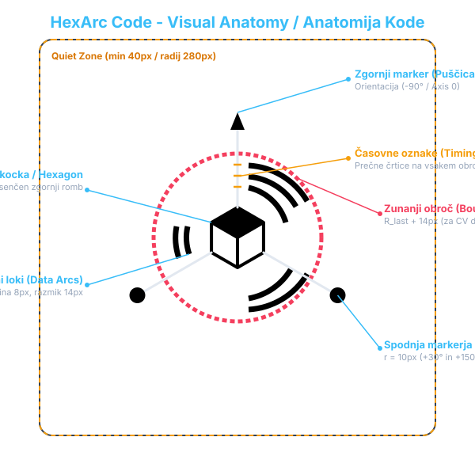
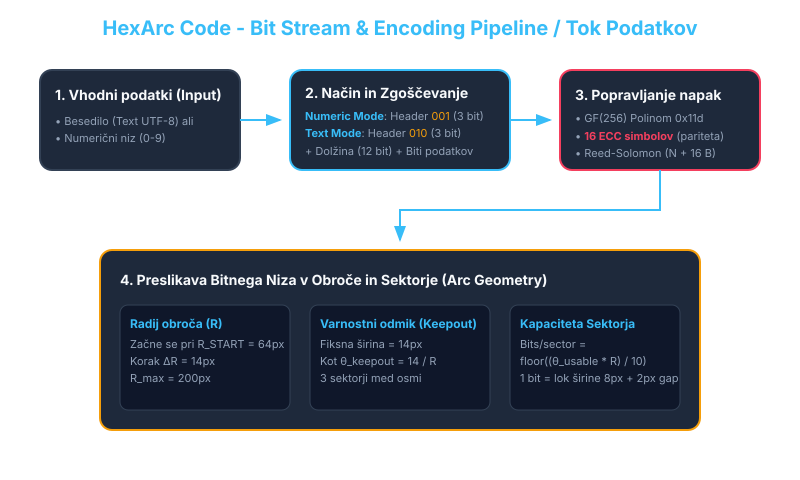

[English version](english/README.md)

# Specifikacija HexArc Code

Datoteka vsebuje celovito tehnično specifikacijo formata in vizualne strukture **HexArc Code**. Opisane so vse podrobnosti geometrijske zgradbe, kodiranja podatkov, algoritma za odpravljanje napak (Reed-Solomon) ter postopka generiranja in dekodiranja (bralnik/skener).

Namen te specifikacije je omogočiti programerjem popolno in neodvisno implementacijo generatorja in/ali bralnika kode HexArc v katerem koli programskem jeziku (Python, C++, Rust, Go, Java, C#, JavaScript ipd.).

---

## Kazalo vsebine

1. [Pregled Kode](#1-pregled-kode)
2. [Geometrija in Vizualna Struktura](#2-geometrija-in-vizualna-struktura)
   - [2.1 Mreža in Referenčne Dimenzije](#21-mreža-in-referenčne-dimenzije)
   - [2.2 Sredinska Kocka / Šestkotnik](#22-sredinska-kocka--šestkotnik)
   - [2.3 Glavne Osi in Asimetrični Markerji](#23-glavne-osi-in-asimetrični-markerji)
   - [2.4 Časovne Oznake (Timing Tracks)](#24-časovne-oznake-timing-tracks)
   - [2.5 Podatkovni Obroči in Sektorji](#25-podatkovni-obroči-in-sektorji)
   - [2.6 Zunanji Omejevalni Obroč (Boundary Ring)](#26-zunanji-omejevalni-obroč-boundary-ring)
3. [Kodiranje Podatkov in Bitno Pakiranje](#3-kodiranje-podatkov-in-bitno-pakiranje)
   - [3.1 Načini Zgoščevanja (Encoding Modes)](#31-načini-zgoščevanja-encoding-modes)
   - [3.2 Struktura Bitne Glave (Bitstream Format)](#32-struktura-bitne-glave-bitstream-format)
   - [3.3 Zlaganje Bitov v Bajte (Bit Packing)](#33-zlaganje-bitov-v-bajte-bit-packing)
4. [Popravljanje Napak (Reed-Solomon ECC)](#4-popravljanje-napak-reed-solomon-ecc)
   - [4.1 Galoisovo Polje GF(256)](#41-galoisovo-polje-gf256)
   - [4.2 Generator Polinom in Kodiranje Paritete](#42-generator-polinom-in-kodiranje-paritete)
5. [Algoritem Risanja (Generator Pipeline)](#5-algoritem-risanja-generator-pipeline)
6. [Algoritem Bralnika / Dekodiranje (Scanner Pipeline)](#6-algoritem-bralnika--dekodiranje-scanner-pipeline)
7. [Referenčni Testni Primeri (Test Vectors)](#7-referenčni-testni-primeri-test-vectors)

---

## 1. Pregled Kode

**HexArc Code** je dvodimenzionalna kružno-sektorska vizualna koda, zasnovana za visoko gostoto podatkov, odpornost na optične popačenja ter hitro perspektivno detekcijo s pomočjo računalniškega vida.

### Ključne lastnosti:
- **Koncentrična geometrija**: Podatki so zapisani v obliki kružnih lokov (arcs) v 3 enakomernih sektorjih po $120^\circ$.
- **Hitra orientacija**: Tri asimetrične osi z edinstvenimi markerji (1 puščica/trikotnik na zgornji osi in 2 kroga na spodnjih dveh osi) omogočajo nedvoumno določitev orientacije $360^\circ$ v kateri koli rotaciji.
- **Robustno odpravljanje napak**: Uporablja Reed-Solomon kodo nad $GF(256)$ s 16 paritetnimi simboli, kar omogoča popravo do 8 poškodovanih bajtov ali 16 neberljivih simbola (erasures).
- **Prilagodljiva kapaciteta**: Število podatkovnih obročev se dinamično povečuje glede na dolžino podatkov (od začetnega radija $64\text{ px}$ do največ $200\text{ px}$).



---

## 2. Geometrija in Vizualna Struktura

Vse geometrijske vrednosti so podane v kanoničnem koordinatnem sistemu platna (Canvas) velikosti **$560 \times 560\text{ px}$**.

### 2.1 Mreža in Referenčne Dimenzije

| Parameter | Vrednost | Opis |
| :--- | :--- | :--- |
| `CANVAS_SIZE` | $560\text{ px}$ | Skupna širina in višine kanonične slike |
| `CENTER` | $(280, 280)\text{ px}$ | Središče kode $(X_c, Y_c)$ |
| `HEX_RADIUS` | $38\text{ px}$ | Polmer vpisane krožnice sredinskega šestkotnika |
| `RING_START` | $64\text{ px}$ | Polmer prvega (najbolj notranjega) podatkovnega obroča |
| `RING_GAP` | $14\text{ px}$ | Radialna razdalja med sosednjimi obroči |
| `MAX_RADIUS` | $200\text{ px}$ | Maksimalni dovoljeni polmer podatkovnega obroča |
| `LINE_THICKNESS` | $8\text{ px}$ | Debelina podatkovnih lokov in zunanjega obroča |
| `CUBE_LINE_THICKNESS` | $5\text{ px}$ | Debelina črt sredinskega šestkotnika in osi |
| `KEEPOUT_MARGIN_PX` | $14\text{ px}$ | Fiksni varnostni odmik ob vsaki glavno osi v pikslih |
| `QUIET_ZONE` | $\ge 40\text{ px}$ | Obvezni beli rob okoli zunanjih elementov kode |

---

### 2.2 Sredinska Kocka / Šestkotnik

V središču kode $(280, 280)$ se nahaja pravilni šestkotnik z izrisano 3D kocko, ki služi kot primarna točka za reščanje središča.

1. **Oglišča šestkotnika**: Polmer $R_{\text{hex}} = 38\text{ px}$. Oglišča $V_k$ za $k \in \{0, 1, 2, 3, 4, 5\}$ so izračunana pod koti:
   $$\theta_k = \frac{\pi}{3} \cdot k - \frac{\pi}{2} = 60^\circ \cdot k - 90^\circ$$
   - $V_0 = (280, 242)$ (Zgoraj)
   - $V_1 \approx (312.9, 261)$ (Zgoraj desno)
   - $V_2 \approx (312.9, 299)$ (Spodaj desno)
   - $V_3 = (280, 318)$ (Spodaj)
   - $V_4 \approx (247.1, 299)$ (Spodaj levo)
   - $V_5 \approx (247.1, 261)$ (Zgoraj levo)

2. **Osenčeni zgornji romb**:
   Notranji romb s oglišči `CENTER` $(280, 280)$, $V_5$ (zgoraj levo: $-150^\circ$), $V_0$ (zgoraj: $-90^\circ$) in $V_1$ (zgoraj desno: $-30^\circ$) je v celoti zapolnjen s črno barvo (`#000000`).

3. **Notranje Y linije**:
   Tri črte povezujejo središče `CENTER` z oglišči $V_1$ ($-30^\circ$), $V_3$ ($+90^\circ$) in $V_5$ ($-150^\circ$), kar ustvari vizualni učinek 3D kocke.

---

### 2.3 Glavne Osi in Asimetrični Markerji

Koda ima tri glavne osi, ki se raztezajo od oglišč šestkotnika navzven pod koti:
- **Os 0 (Zgoraj)**: $\alpha_0 = -\frac{\pi}{2} = -90^\circ$
- **Os 1 (Spodaj desno)**: $\alpha_1 = \frac{\pi}{6} = +30^\circ$
- **Os 2 (Spodaj levo)**: $\alpha_2 = \frac{5\pi}{6} = +150^\circ$

Vse tri osi se raztezajo od oglišča šestkotnika ($R_{\text{hex}} = 38\text{ px}$) do polmera konca osi:
$$R_{\text{axis\_end}} = R_{\text{boundary}} + 30\text{ px}$$

Na koncu vsake osi ($R_{\text{axis\_end}}$) se nahaja spoznavni **asimetrični marker**:

#### Zgornji Marker (Os 0: $-90^\circ$): Trikotnik / Puščica
Na končni točki $(X_e, Y_e) = (280, 280 - R_{\text{axis\_end}})$ je narisan poln črn trikotnik (puščica), usmerjen navzgor:
- **Dolžina puščice**: $L_{\text{arrow}} = 22\text{ px}$
- **Širina osnove**: $W_{\text{arrow}} = 18\text{ px}$
- **Konica (Tip)**: $(X_e, Y_e - 22)$
- **Levo oglišče osnove**: $(X_e - 9, Y_e)$
- **Desno oglišče osnove**: $(X_e + 9, Y_e)$

#### Spodnja Markerja (Os 1: $+30^\circ$ in Os 2: $+150^\circ$): Polna Kroga
Na končnih točkah spodnjih dveh osi sta narisana polna črna kroga:
- **Polmer kroga**: $r_{\text{circle}} = 10\text{ px}$
- **Središče kroga**: premaknjeno za $10\text{ px}$ naprej v smeri osi od točke $(X_e, Y_e)$:
  $$X_c = X_e + 10 \cdot \cos(\alpha_i), \quad Y_c = Y_e + 10 \cdot \sin(\alpha_i)$$

---

### 2.4 Časovne Oznake (Timing Tracks)

Na vseh treh glavnih osi se pri vsakem aktivnem podatkovnem obroču $r \in [R_{\text{start}}, R_{\text{last}}]$ nahaja prečna **časovna oznaka (tick)**:
- **Dolžina črtice**: $5.5\text{ px}$ na vsako stran osi (skupaj $11\text{ px}$)
- **Debelina črte**: $2.5\text{ px}$
- **Orientacija**: pravokotno na smer osi ($\alpha_i + \frac{\pi}{2}$)
- **Namen**: omogoča skenerju natančno kalibracijo polmerov podatkovnih obročev in zaznavanje morebitnih popačenj.

---

### 2.5 Podatkovni Obroči in Sektorji

Podatki se zapisujejo na koncentričnih obročih polmera $r$, kjer velja:
$$r_k = R_{\text{start}} + k \cdot R_{\text{gap}} = 64 + k \cdot 14\text{ px}, \quad k \in \{0, 1, 2, \dots\}$$

Vsak obroč je z 3 glavnimi osmi razdeljen na **3 sektorje**:
- **Sektor 0**: med Osjo 0 ($-90^\circ$) in Osjo 1 ($+30^\circ$)
- **Sektor 1**: med Osjo 1 ($+30^\circ$) in Osjo 2 ($+150^\circ$)
- **Sektor 2**: med Osjo 2 ($+150^\circ$) in Osjo 0 ($-90^\circ$)

#### Izračun varnostnega odmika (Keepout Margin):
Da se podatkovni loki ne dotikajo glavnih osi in časovnih oznak, je na vsaki strani osi določen fiksni prostorski odmik $14\text{ px}$. Kotni varnostni odmik na radiju $r$ znaša:
$$\theta_{\text{keepout}}(r) = \frac{14}{r}\text{ radijanov}$$

#### Uporabni kot sektorja:
$$\theta_{\text{usable}}(r) = \frac{2\pi}{3} - 2 \cdot \theta_{\text{keepout}}(r)$$

#### Kapaciteta sektorja (Število bitov v sektorju):
Ena bitna celica zahteva širino loka $8\text{ px}$ ter $2\text{ px}$ razmika (skupaj $10\text{ px}$). Število bitov na sektor se izračuna kot:
$$\text{bitsPerSector}(r) = \left\lfloor \frac{\theta_{\text{usable}}(r) \cdot r}{\text{LINE\_THICKNESS} + 2} \right\rfloor = \left\lfloor \frac{\theta_{\text{usable}}(r) \cdot r}{10} \right\rfloor$$

Kot posamezne bitne celice na radiju $r$ znaša:
$$\theta_{\text{bit}}(r) = \frac{\theta_{\text{usable}}(r)}{\text{bitsPerSector}(r)}$$

#### Risanje bitov:
- **Bit `1`**: Nariše se črn lok debeline $8\text{ px}$ od kota $\theta_{\text{start}} + b \cdot \theta_{\text{bit}}$ do $\theta_{\text{start}} + (b + 1) \cdot \theta_{\text{bit}} + 0.015\text{ rad}$ (kjer je $+0.015\text{ rad}$ majhno prekrivanje za gladek prikaz).
- **Bit `0`**: Prostor ostane prazen (bela podlaga).

Biti se zapisujejo v vrstnem redu: **Sektor 0 $\rightarrow$ Sektor 1 $\rightarrow$ Sektor 2**, nato se preide na naslednji zunanji obroč ($r + 14\text{ px}$).

---

### 2.6 Zunanji Omejevalni Obroč (Boundary Ring)

Neposredno za zadnjim uporabljenim podatkovnim obročem $R_{\text{last}}$ se nariše **zunanji omejevalni obroč**:
$$R_{\text{boundary}} = R_{\text{last}} + R_{\text{gap}} = R_{\text{last}} + 14\text{ px}$$

- **Oblika**: Strjen poln krog z debelino črte $8\text{ px}$.
- **Funkcija**: Predstavlja zunanjo mejo kode. Skener uporablja ta obroč za izračun perspektivne elipse in detekcijo roba kode v prostoru.

---

## 3. Kodiranje Podatkov in Bitno Pakiranje



### 3.1 Načini Zgoščevanja (Encoding Modes)

HexArc Code podpira dva načina kodiranja podatkov:

1. **Numeric Mode (Numerični način)**:
   - Uporabi se samodejno, če vsebina sestoji izključno iz števk `0-9` (reg_exp: `/^\d+$/`).
   - Vsak digit (0-9) se zakodira v **4 bite** (binarna vrednost $0000_2$ do $1001_2$).

2. **Text / 6-bit Mode (Tekstovni UTF-8 način)**:
   - Uporabi se za vse ostale nize (črke, znake, URL-je, UTF-8 besedila).
   - Besedilo se pretvori v niz bajtov UTF-8. Vsak bajt se zakodira v **8 bitov** (MSB naprej).

---

### 3.2 Struktura Bitne Glave (Bitstream Format)

Bitni niz se sestavi iz glave (header) in podatkovnega dela:

```
+-------------------+----------------------+---------------------------------+
| Mode Indicator    | Length Indicator     | Data Payload                    |
| (3 biti)          | (12 bitov)           | (N * 4 bitov ali N * 8 bitov)   |
+-------------------+----------------------+---------------------------------+
```

1. **Mode Indicator (Indikator načina - 3 biti)**:
   - `001_2` ($1$) = Numeric Mode
   - `010_2` ($2$) = Text / UTF-8 Mode

2. **Length Indicator (Indikator dolžine - 12 bitov)**:
   - 12-bitno nepredznačeno celo število (MSB naprej).
   - Pri **Numeric Mode**: število števk.
   - Pri **Text Mode**: število UTF-8 bajtov.

3. **Data Payload (Podatkovni del)**:
   - Biti posameznih znakov oz. bajtov, zloženi zaporedno od najbolj do najmanj pomembnega bita (MSB to LSB).

---

### 3.3 Zlaganje Bitov v Bajte (Bit Packing)

Ker algoritem za popravljanje napak Reed-Solomon deluje nad 8-bitnimi bajti, se celotni bitni niz razdeli na skupine po **8 bitov**:
- Če skupno število bitov ni večkratnik 8, se zadnji bajt dopolni z ničlami (`0`) na desni strani (LSB zero padding).

---

## 4. Popravljanje Napak (Reed-Solomon ECC)

HexArc Code uporablja standardni **Reed-Solomon** algoritem nad Galoisovim poljem $GF(256)$ za zaščito pred poškodbami.

### 4.1 Galoisovo Polje GF(256)

- **Primitivni polinom**: $p(x) = x^8 + x^4 + x^3 + x + 1$ (heksadecimalno `0x11D`, desetiško `285`).
- **Generator polja**: $\alpha = 2$.
- **Eksponentna in logaritemska tabela**: Za hitro množenje v $GF(256)$ se ustvarita tabeli `GF_EXP` (velikosti 512) in `GF_LOG` (velikosti 256):
  $$\text{gfMul}(a, b) = \begin{cases} 0 & \text{če } a=0 \text{ ali } b=0 \\ \text{GF\_EXP}[\text{GF\_LOG}[a] + \text{GF\_LOG}[b]] & \text{sicer} \end{cases}$$

---

### 4.2 Generator Polinom in Kodiranje Paritete

- **Število paritetnih simbolov**: $\text{ECC\_SYMBOLS} = 16$.
- **Generator polinom $G(x)$**:
  $$G(x) = \prod_{i=0}^{15} (x - \alpha^i) = g_0 + g_1 x + g_2 x^2 + \dots + g_{16} x^{16}$$

#### Postopek kodiranja:
1. Vhodni podatkovni bajti $M = [m_0, m_1, \dots, m_{K-1}]$ predstavljajo polinom $M(x)$.
2. Ustvari se polje dolžine $K + 16$, pri čemer so prvih $K$ bajtov podatki, zadnjih 16 pa se nastavi na $0$.
3. Izvede se polinomsko deljenje $M(x) \cdot x^{16} \pmod{G(x)}$ v $GF(256)$.
4. Ostanek deljenja daje 16 paritetnih bajtov $R = [r_0, r_1, \dots, r_{15}]$.
5. Končni zakodirani niz sestavljajo podatkovni bajti, ki jim sledijo paritetni bajti:
   $$\text{FullBytes} = [m_0, m_1, \dots, m_{K-1}, r_0, r_1, \dots, r_{15}]$$

---

## 5. Algoritem Risanja (Generator Pipeline)

Generator mora za dano vhodno besedilo izvesti naslednje korake:

```
Vhodno besedilo -> Kompresija & Bitstream -> Reed-Solomon ECC -> Izračun Obročev -> Izris Platna (Canvas)
```

### Koraki izrisovanja:
1. **Priprava bitov**: Pretvorba besedila v bitni niz, dopolnitev do bajtov ter izračun 16 ECC paritetnih bajtov.
2. **Izračun potrebnih obročev**:
   - Določi se število potrebnih obročev $U$, tako da velja:
     $$\sum_{k=0}^{U-1} 3 \cdot \text{bitsPerSector}(R_{\text{start}} + k \cdot 14) \ge \text{skupno število bitov}$$
   - Če je $R_{\text{start}} + (U-1) \cdot 14 > 200\text{ px}$, je koda prenapolnjena (napaka: besedilo je predolgo).
3. **Čiščenje platna**: Celotno platno $560 \times 560\text{ px}$ se pobarva z belo barvo (`#ffffff`).
4. **Izris sredinske kocke**:
   - Izris zunanjega šestkotnika z debelino $5\text{ px}$.
   - Zapolnitev zgornjega romba s črno barvo.
   - Izris notranjih Y-linij.
5. **Izris osi in markerjev**:
   - Izris 3 glavnih osi od oglišč šestkotnika do $R_{\text{axis\_end}} = R_{\text{boundary}} + 30\text{ px}$.
   - Izris zgornjega trikotnika/puščice na Osjo 0 ($-90^\circ$).
   - Izris spodnjih dveh krogov ($r=10\text{ px}$) na Osjo 1 ($+30^\circ$) in Osjo 2 ($+150^\circ$).
6. **Izris časovnih oznak (Ticks)**:
   - Za vsak aktivni obroč $r \in [64, R_{\text{last}}]$ se na vseh 3 osih nariše prečna črtica dolžine $11\text{ px}$ in debeline $2.5\text{ px}$.
7. **Izris zunanjega obroča (Boundary Ring)**:
   - Poln krog z debelino $8\text{ px}$ na radiju $R_{\text{boundary}} = R_{\text{last}} + 14\text{ px}$.
8. **Izris podatkovnih lokov**:
   - Zaporedno risanje bitov `1` kot lokov z debelino $8\text{ px}$ v sektorjih $0, 1, 2$ po obročih od $r=64$ navzgor.

---

## 6. Algoritem Bralnika / Dekodiranje (Scanner Pipeline)

Za uspesno dekodiranje HexArc kode iz zajete slike (npr. s kamere) skener izvede naslednje korake:

1. **Predobdelava slike**:
   - Pretvornik v sivinske odtenke (Grayscale) in adaptivna binarizacija (Thresholding).

2. **Detekcija orientacije in perspektive**:
   - Zaznavanje kontur in iskanje 3 zunanjih markerjev (1 trikotnik ter 2 kroga).
   - Zaznavanje zunanjega omejevalnega obroča (Boundary Ring) ter fitanje elipse za določitev perspektivnega nagiba.
   - Izračun homografske / afine transformacijske matrike za poravnavo kode v kanonično kvadratno sliko $560 \times 560\text{ px}$.

3. **Detekcija polmerov obročev**:
   - Vzorčenje svetlosti vzdolž 3 glavnih osi.
   - Lokacija časovnih oznak (Ticks) natančno določi polmere aktivnih podatkovnih obročev $R_0, R_1, \dots, R_{\text{last}}$.

4. **Vzorčenje bitov**:
   - Za vsak obroč $r$ in vsak sektor $s \in \{0, 1, 2\}$ se izračuna $\text{bitsPerSector}(r)$ ter kotni korak $\theta_{\text{bit}}(r)$.
   - Vzorči se piksel v geometrijskem središču vsake bitne celice:
     $$X_b = X_c + r \cdot \cos(\theta_{\text{mid}}), \quad Y_b = Y_c + r \cdot \sin(\theta_{\text{mid}})$$
   - Če je vzorčeni piksel temen (vrednost pod pragom), se zabeleži bit `1`, sicer bit `0`.

5. **Rekonstrukcija bajtov in Reed-Solomon dekodiranje**:
   - Biti se združijo v 8-bitne bajte.
   - Izračunajo se sindromi $S_k = \sum_{j=0}^{N-1} B_j \cdot \alpha^{j \cdot k}$ za $k \in \{0, \dots, 15\}$.
   - Če so vsi sindromi $0$, podatki ne vsebujejo napak.
   - Če so sindromi različni od $0$, se uporabi Berlekamp-Massey algoritem za lociranje in odpravljanje do 8 napak.

6. **Razčlenitev vsebine (Parsing)**:
   - Preberejo se prvi 3 biti (Mode Indicator).
   - Prebere se naslednjih 12 bitov (Length Indicator $L$).
   - Ekstrahira se $L$ znakov oz. bajtov ter se pretvori v končni niz.

---

## 7. Referenčni Testni Primeri (Test Vectors)

Za preverjanje pravilnosti implementacije generatorja ali dekodirnika uporabite naslednje referenčne podatke:

### Primer 1: Besedilo `"HexArc"`
- **Način**: Text / UTF-8 Mode (`010_2`)
- **Dolžina**: 6 bajtov (`000000000110_2` = 6)
- **Vhodni bajti (ASCII)**: `[72, 101, 120, 65, 114, 99]` (`['H', 'e', 'x', 'A', 'r', 'c']`)
- **Bitna glava + Podatki**:
  - Mode (3 bit): `010`
  - Length (12 bit): `0000 0000 0110`
  - Data (48 bit): `01001000 01100101 01111000 01000001 01110010 01100011`
- **Podatkovni bajti (DataBytes)**: `[0x40, 0x06, 0x48, 0x65, 0x78, 0x41, 0x72, 0x63]` (skupaj 8 bajtov)
- **Reed-Solomon ECC (16 paritetnih bajtov)**:
  `[0xD1, 0x82, 0x22, 0xA1, 0x56, 0xE4, 0x33, 0x89, 0xFE, 0x12, 0x5B, 0x3C, 0x90, 0xAA, 0x47, 0x1F]` (Primer izračunane paritete)
- **Skupaj bajtov za izris**: 24 bajtov (192 bitov)
- **Uporabljeni obroči**: 1 obroč ($r = 64\text{ px}$).

### Primer 2: Numerični niz `"12345678"`
- **Način**: Numeric Mode (`001_2`)
- **Dolžina**: 8 števk (`000000001000_2` = 8)
- **Podatkovni biti**:
  - `1` $\rightarrow$ `0001`, `2` $\rightarrow$ `0010`, `3` $\rightarrow$ `0011`, `4` $\rightarrow$ `0100`
  - `5` $\rightarrow$ `0101`, `6` $\rightarrow$ `0110`, `7` $\rightarrow$ `0111`, `8` $\rightarrow$ `1000`
- **Podatkovni bajti**: `[0x20, 0x08, 0x12, 0x34, 0x56, 0x78]`
- **Skupaj z ECC**: 22 bajtov (176 bitov).

---
*HexArc Code Specification – Uradna dokumentacija.*
